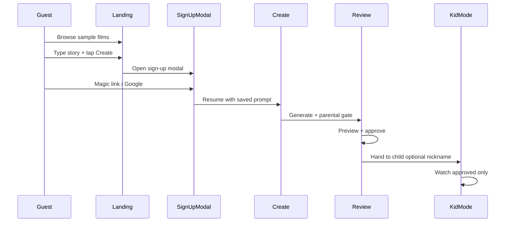

# WonderReel — User Flow v2 (Landing-First)

> Aligns with PRD v1.3 UX delta. Safety invariants unchanged: parent approves before child watches.

## Personas

| Persona | Goal | Never sees |
|---------|------|------------|
| **Guest parent** | Browse samples, try prompt | Create pipeline, child data forms |
| **Signed-in parent** | Create → review → hand off | — |
| **Child (viewer)** | Watch approved films | Prompt, settings, sign-out |

## Flow 0 — Activation (happy path)

## Screen map

| Route | Guest | Parent | Kid handoff |
|-------|-------|--------|-------------|
| `/dashboard` | Prompt + catalog grid | Same + pending banner | — |
| `/create` | Sign-up modal from landing | Gate + generate | — |
| `/review` | Login required | Approve / discard | — |
| `/kid` | Login required | — | Viewer setup → handoff ritual |

## Child profile (privacy model)

| When | What | Required? |
|------|------|-----------|
| Sign-up | Email / OAuth only | Yes |
| First create | Silent default viewer (`My child`) | Auto if none |
| Kid handoff | Nickname + avatar (optional) | Recommended |
| Settings | Add second child, age band | Optional |

**Copy:** *Use a nickname — real names aren't required.*

## Mobile layout (≤480px)

- Prompt box above fold or sticky
- Film catalog: 2-column grid, thumb + title + description
- Bottom nav when authenticated
- Sign-up: full-screen sheet modal

## Out of scope v1

- **Image generation** tag (video-only via PixVerse)
- Child login
- Public sharing between accounts
